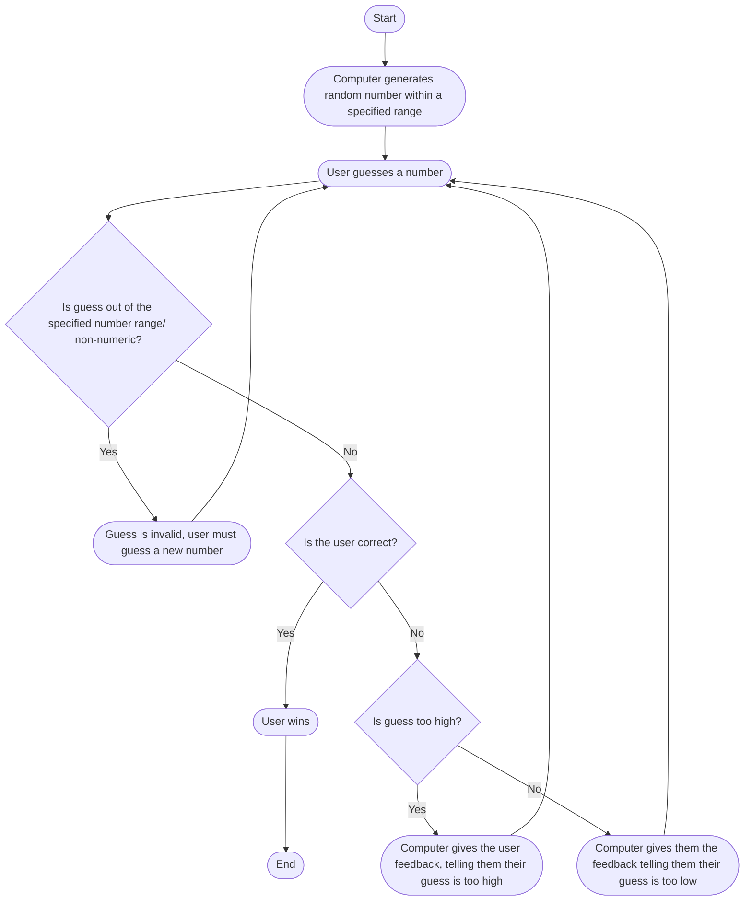

 * The game begins with the computer generating a random number within a specified range.
 * The user would then make a guess as to what the number is.
 * The computer first checks if the guess is valid, that is, it is in the specified range and numeric value.
 * If it is not, the user is prompted to make a different guess.
 * If it is, the computer gives feedback on the user's guess (i.e. too high, too low, correct).
 * Based on the feedback received, the user continues guessing until the guess is correct.
 * When the user guesses the correct number, the game ends.
  